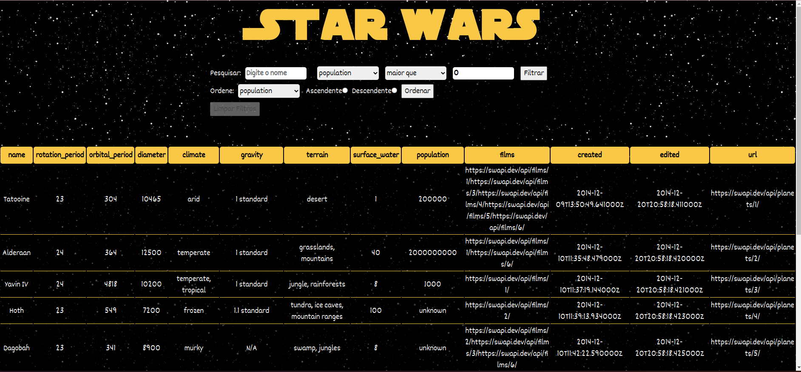
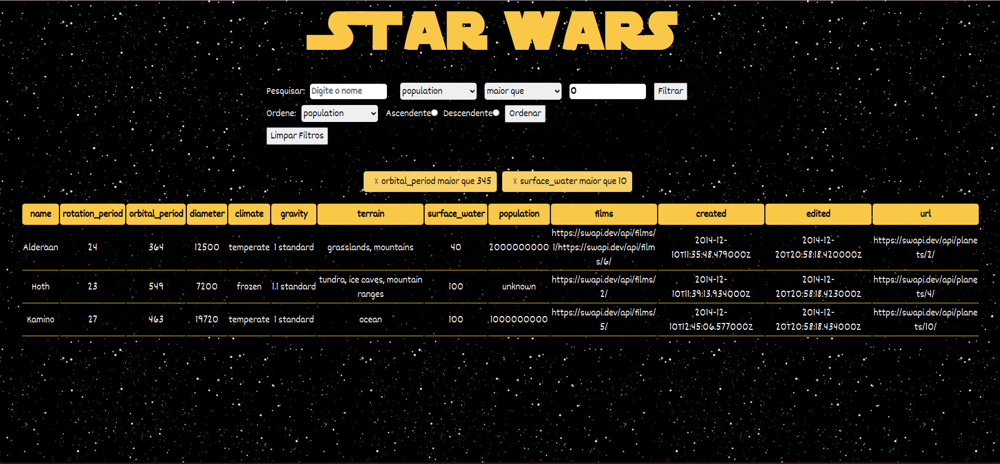

<div align="center">
<h1>Star Wars Filters 🌟</h1> 
</div>

<h2>Descrição</h2>
Esse projeto é sobre uma tabela de planetas que aplico lógica de diversos filtros com Javascript.

Para construção, usei a api de planetas e pratiquei conhecimentos em React js, Hooks, Context, Testes e CSS.

<h2>Funcionalidades</h2>

* Filtros diversos<br>
* Exclusão de todos os filtros ou um filtro específico<br>


<h2>Testes</h2>

O desenvolvimento do Star Wars Filters segue a metodologia de Test-Driven Development (TDD), o que significa que antes de escrever o código de implementação, são criados testes automatizados para cada funcionalidade. Esses testes garantem que o código funcione corretamente e evitam regressões em futuras alterações.

<h2>Instalação</h2>

1 - Clone este repositório em sua máquina local:

```
git@github.com:adrielle-b/starwars-filters.git
```

2 - Acesse o diretório do projeto:

```
cd starwars-filters
```

3 - Instale as dependências necessárias:

```
npm install
```

<h2>Como usar</h2>

1 - Execute o aplicativo:

```
npm start
```
<h2>Ilustração</h2>
<div align="center" width="300">
  

  

</div>
