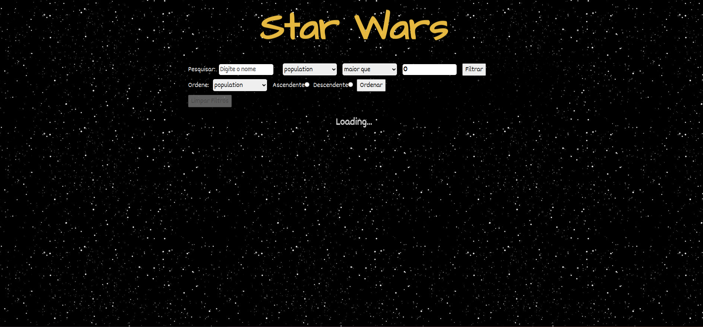
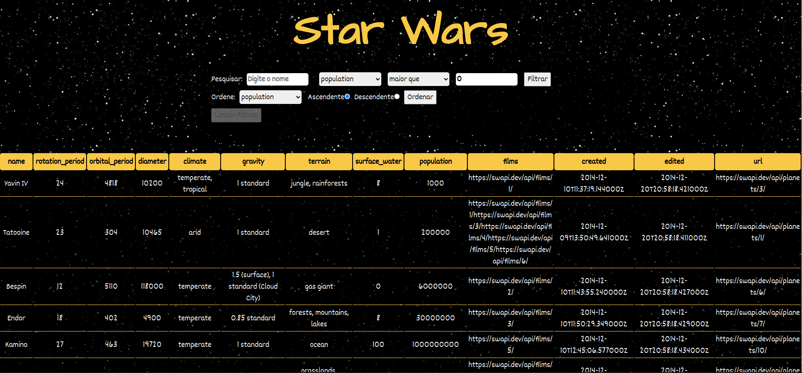
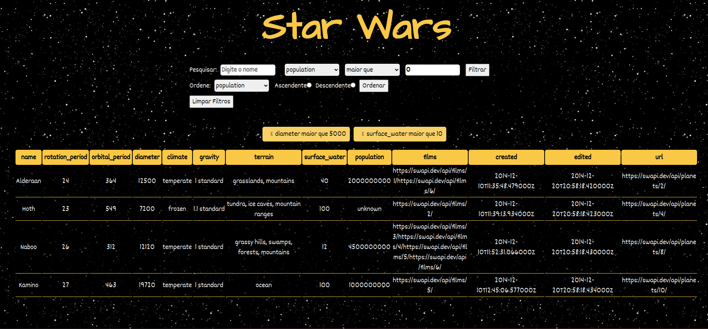

# Projeto Star Wars Trybe

Um projeto de apenas uma página que pude praticar lógica de filtros. Esse projeto é sobre uma tabela de planetas que aplico diversos filtros.

Para contrução, usei a api de planetas e pratiquei conhecimentos em React js, Hooks, Context, Testes e CSS.

